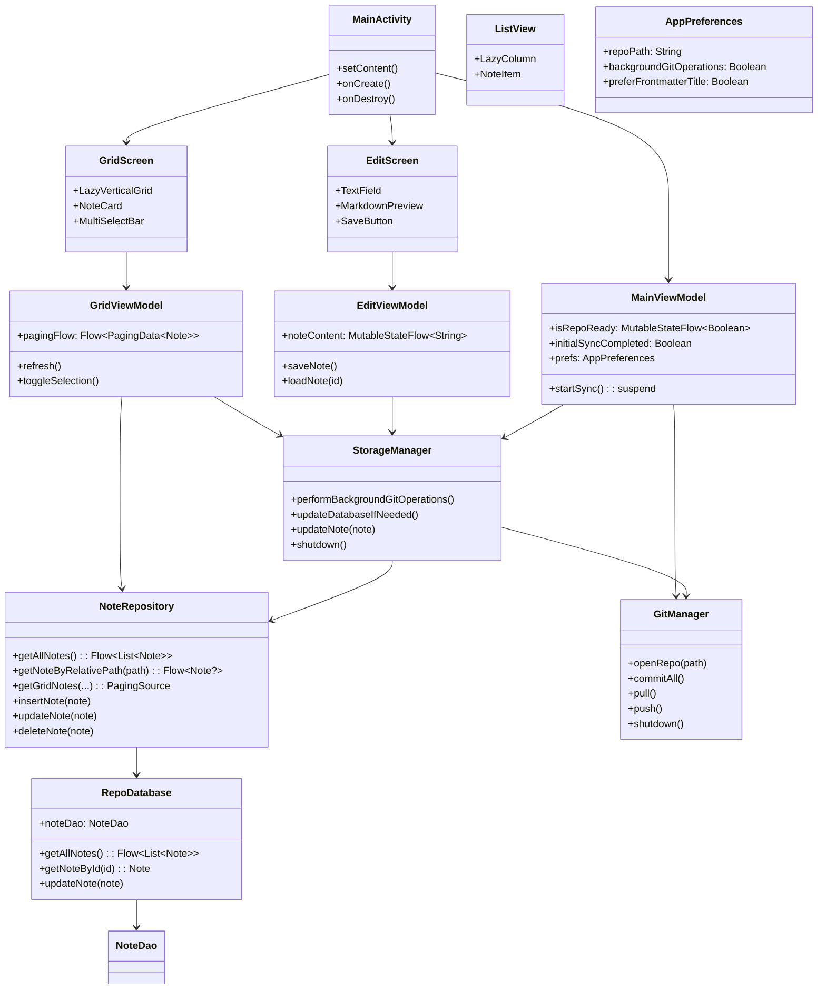
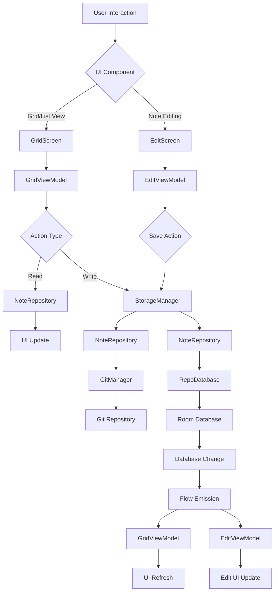

# GitTasks App Design Document

## Overview

GitTasks is an Android note-taking application that integrates with Git for version control and synchronization. The app uses a clean architecture with MVVM pattern, leveraging Jetpack Compose for UI, Room for local database, and libgit2 (via JNI) for Git operations.

This document describes the core components and their interactions, focusing on data flow, state management, and refresh mechanisms.

## Architecture Overview

The app follows MVVM architecture with the following layers:

- **Data Layer**: Repository (Git), Database (Room), Preferences
- **Domain Layer**: Business logic in Managers and Services
- **Presentation Layer**: ViewModels and Compose UI

### Key Components

- **Repository**: Git repository for version-controlled notes
- **NoteRepository**: Centralized data access layer providing reactive Flows for notes and folders
- **Database**: Room database storing note metadata and content
- **MainViewModel**: App-level state management and synchronization
- **GridViewModel**: Grid display logic with paging, observes NoteRepository Flows
- **GridScreen**: Compose UI for note grid display
- **ListView**: Reusable Compose component for displaying notes in list format
- **EditScreen**: Compose UI for viewing and editing individual notes
- **EditViewModel**: Manages note editing state and operations
- **StorageManager**: Handles Git operations and database updates via NoteRepository

## Component Architecture Diagram

## Data Flow Diagram

## App Startup Flow

1. **MainActivity.onCreate()**: Check preferences and repo path existence via `MainViewModel.tryInit()`
2. **UI Loads Immediately**: Show GridScreen/EditScreen based on saved state (no loading screen)
3. **Background Sync Starts**: `MainViewModel.startSync()` opens repository asynchronously
4. **Data Updates**: UI reacts to database changes via Flow observations as sync completes

## App Shutdown Flow

1. **MainActivity.onDestroy()**: Initiates graceful shutdown sequence
2. **StorageManager.shutdown()**: Cancels all background git operations and waits for completion
3. **GitManager.shutdown()**: Closes repository and frees native libgit2 resources
4. **Resource Cleanup**: Prevents RepoNotInit errors during activity recreation by ensuring no background operations access closed repository

## Component Descriptions

### Repository (Git)

- **Purpose**: Version-controlled storage for note files
- **Technology**: libgit2 via Rust JNI
- **Operations**: Commit, pull, push, status checks
- **Integration**: Managed by GitManager

### NoteRepository

- **Purpose**: Centralized data access layer for all note and folder operations
- **Methods**: Reactive Flows for notes, paging sources, CRUD operations
- **Integration**: Used by ViewModels and StorageManager for consistent data access

### Database (Room)

- **Purpose**: Local cache of note metadata and content
- **Tables**: Notes (id, path, content, timestamps)
- **Queries**: Paginated note lists, individual note retrieval
- **Updates**: Triggered by Git operations via StorageManager

### StorageManager

- **Purpose**: Orchestrates Git operations and database synchronization with proper lifecycle management
- **Responsibilities**:
  - Manages git operation queue with debouncing and background execution
  - Handles database updates after successful git operations
  - Provides graceful shutdown to prevent resource leaks and RepoNotInit errors
- **Key Methods**:
  - `performBackgroundGitOperations()`: Executes queued git operations (pull/push) in background
  - `updateDatabaseIfNeeded()`: Synchronizes database with current repository state
  - `shutdown()`: Cancels all background operations and waits for completion before shutdown
- **Queue Management**: Uses unified queue for commits and pulls with configurable debouncing

### GitManager

- **Purpose**: Low-level Git operations interface with proper resource management
- **Technology**: libgit2 via Rust JNI with mutex-protected access
- **Operations**: Repository lifecycle (open/close), commits, pull/push, conflict resolution
- **Key Methods**:
  - `openRepo()`: Opens existing repository
  - `commitAll()`: Stages and commits all changes
  - `pull()` / `push()`: Synchronization with remote repository
  - `shutdown()`: Closes repository and frees native resources
- **State Management**: Tracks repository initialization state to prevent duplicate operations

### MainViewModel

- **Responsibilities**:
  - App initialization and repository opening
  - Background synchronization scheduling with lifecycle awareness
  - Global state management (repo readiness)
  - Preventing duplicate background operations during activity recreation
- **Key Methods**:
  - `startSync()`: Opens repo and starts background sync (only performs expensive operations once per app session)
  - `tryInit()`: Checks if app is configured
- **State**:
  - `isRepoReady` Flow controls UI visibility
  - `initialSyncCompleted` flag prevents duplicate background sync operations during screen rotation
- **Lifecycle**: Cancels sync operations in `onCleared()` to prevent resource leaks

### MainActivity

- **Responsibilities**:
  - App entry point and UI composition
  - Proper component shutdown during app termination
  - Language switching with activity recreation
- **Key Methods**:
  - `onCreate()`: Initializes UI and starts sync
  - `onDestroy()`: Gracefully shuts down StorageManager and GitManager to prevent background operations from accessing closed resources
- **Shutdown Process**: Ensures all background git operations complete before closing repository to prevent RepoNotInit errors

### GridViewModel

- **Responsibilities**:
  - Grid display logic and pagination
  - Multi-select mode management
  - Note operations (create, update, delete)
- **Key Flows**:
  - `pagingFlow`: Paginated note data from NoteRepository
  - Selection state management
- **Data Access**: Observes NoteRepository Flows for reactive UI updates
- **Interactions**: Calls StorageManager for data changes

### GridScreen

- **Purpose**: Main note browsing interface in grid layout
- **Components**:
  - LazyVerticalGrid for note cards
  - Multi-select action bar
  - Search/filter controls
- **State**: Collects from GridViewModel, triggers actions

### ListView

- **Purpose**: Reusable Compose component for displaying notes in vertical list format
- **Features**: Lazy loading, item selection, swipe actions
- **Usage**: Can be used in different screens for list-based note display (alternative to grid)

### EditScreen

- **Purpose**: Interface for viewing and editing individual notes
- **Components**:
  - TextField for note content editing
  - Markdown preview/rendering
  - Save/discard buttons
  - Metadata display (created/updated dates)
- **State**: Collects from EditViewModel, handles save operations

### EditViewModel

- **Responsibilities**:
  - Load note content for editing
  - Manage editing state (unsaved changes, etc.)
  - Save/update notes via StorageManager
  - Handle note creation vs. editing modes
- **Key Flows**:
  - `noteContent`: Current note text state
  - `isUnsaved`: Tracks if changes need saving
- **Interactions**: Calls StorageManager for persistence, navigates back on save

## MVVM Implementation

### Model Layer

- **Data Classes**: `Note`, `StorageConfiguration`, `Signature`
- **Repositories**: `NoteRepository` provides centralized reactive data access
- **Managers**: `GitManager`, `StorageManager` handle business logic

### ViewModel Layer

- **State Management**: MutableStateFlow for reactive UI updates
- **Data Transformation**: Converts database entities to UI models
- **Action Handling**: Processes user intents, coordinates with managers

### View Layer

- **Compose Components**: Stateless, receive state and event handlers
- **State Collection**: `collectAsState()` for reactive updates
- **Event Propagation**: Lambda callbacks to ViewModels

### Data Update Flow

1. **User Action**: Click, swipe, or input in UI component
   - **Grid/List View**: Select note → navigate to EditScreen
   - **Edit View**: Type text → update noteContent state
   - **Save Action**: Click save → trigger persistence
2. **Event Handler**: Passed from ViewModel, triggers business logic
   - GridViewModel: `onNoteClick(note)` → navigation
   - EditViewModel: `onSave()` → validate and persist
3. **Data Modification**: ViewModel calls Manager/Service methods
   - EditViewModel → StorageManager.updateNote()
   - StorageManager → NoteRepository.insertNote() + GitManager.commitAll()
4. **Persistence**: Updates database and/or Git repository
   - NoteRepository: Insert/update note entity
   - Git: Stage, commit changes to files
5. **State Update**: ViewModel emits new state via Flow
   - GridViewModel: pagingFlow emits updated data
   - EditViewModel: isUnsaved = false, navigate back
6. **UI Refresh**: Compose collects state and recomposes
   - GridScreen: Shows updated note list
   - EditScreen: Clears unsaved state, returns to grid

## Refresh Mechanisms

### Database-Driven Refresh

- **Trigger**: Git operations update database via StorageManager
- **Mechanism**: NoteRepository's `Flow` emissions notify ViewModels
- **Propagation**: ViewModel transforms data, emits UI state
- **UI Update**: Compose `collectAsState()` triggers recomposition

### Manual Refresh

- **Trigger**: User pull-to-refresh or sync button
- **Mechanism**: ViewModel calls `refresh()` on paging source
- **Implementation**: `Pager` invalidates data, refetches from database

### Sync-Based Refresh

- **Trigger**: Background sync completes
- **Mechanism**: StorageManager updates database via NoteRepository, triggers Flow emissions
- **Scope**: Affects all open screens displaying note data

### State Flow Updates

- **ViewModel State**: `MutableStateFlow` for loading, selection, error states
- **UI Collection**: `collectAsState()` in Composable functions
- **Recomposition**: Automatic when state changes
