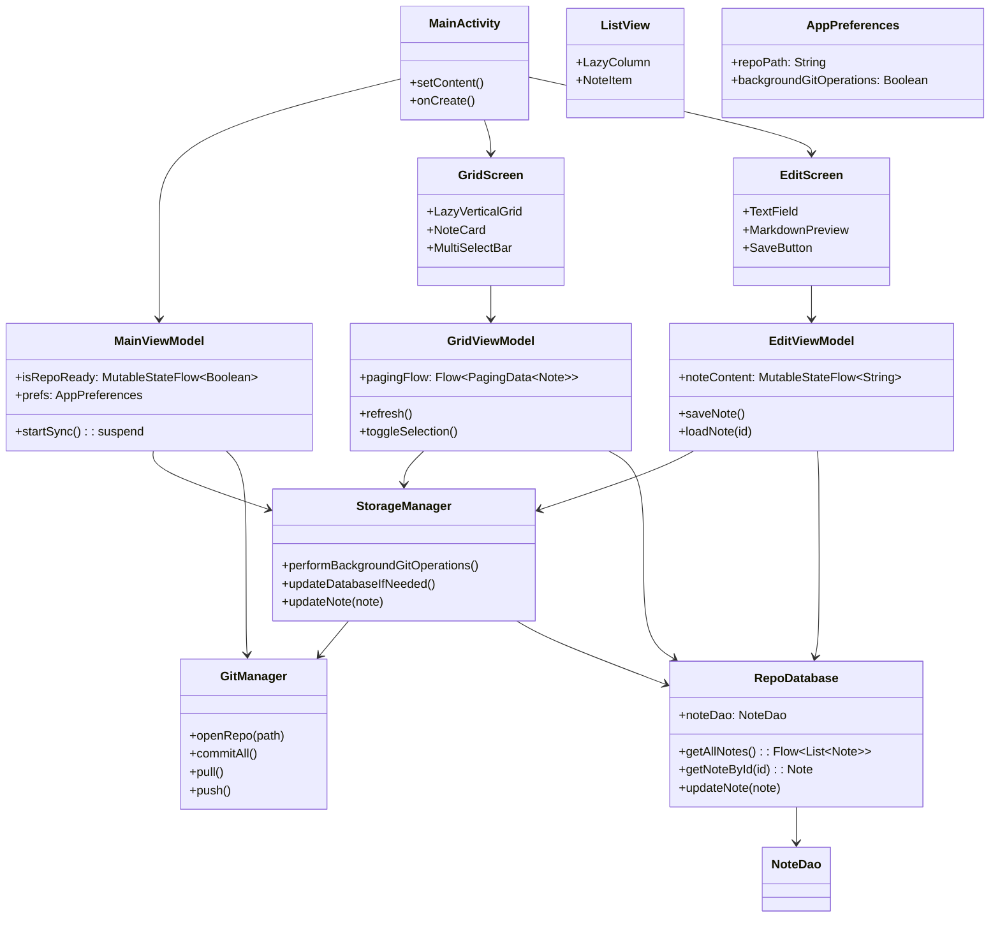
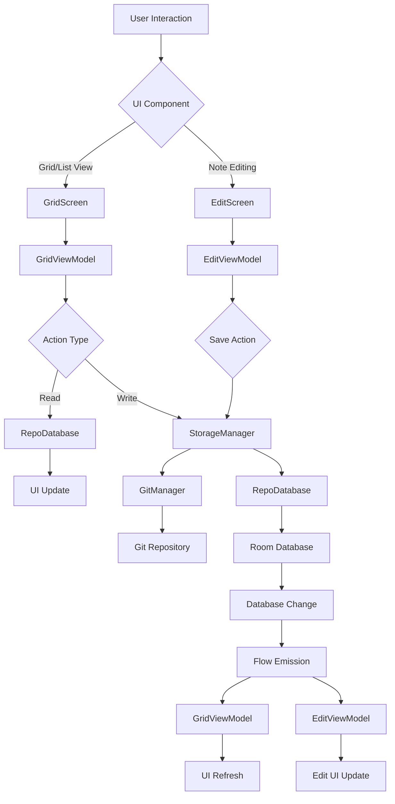

# GitNote App Design Document

## Overview

GitNote is an Android note-taking application that integrates with Git for version control and synchronization. The app uses a clean architecture with MVVM pattern, leveraging Jetpack Compose for UI, Room for local database, and libgit2 (via JNI) for Git operations.

This document describes the core components and their interactions, focusing on data flow, state management, and refresh mechanisms.

## Architecture Overview

The app follows MVVM architecture with the following layers:

- **Data Layer**: Repository (Git), Database (Room), Preferences
- **Domain Layer**: Business logic in Managers and Services
- **Presentation Layer**: ViewModels and Compose UI

### Key Components

- **Repository**: Git repository for version-controlled notes
- **Database**: Room database storing note metadata and content
- **MainViewModel**: App-level state management and synchronization
- **GridViewModel**: Grid display logic with paging
- **GridScreen**: Compose UI for note grid display
- **ListView**: Reusable Compose component for displaying notes in list format
- **EditScreen**: Compose UI for viewing and editing individual notes
- **EditViewModel**: Manages note editing state and operations

## Component Architecture Diagram

## Data Flow Diagram

## App Startup Flow

1. **MainActivity.onCreate()**: Check preferences and repo path existence via `MainViewModel.tryInit()`
2. **UI Loads Immediately**: Show GridScreen/EditScreen based on saved state (no loading screen)
3. **Background Sync Starts**: `MainViewModel.startSync()` opens repository asynchronously
4. **Data Updates**: UI reacts to database changes via Flow observations as sync completes

## Component Descriptions

### Repository (Git)
- **Purpose**: Version-controlled storage for note files
- **Technology**: libgit2 via Rust JNI
- **Operations**: Commit, pull, push, status checks
- **Integration**: Managed by GitManager

### Database (Room)
- **Purpose**: Local cache of note metadata and content
- **Tables**: Notes (id, path, content, timestamps)
- **Queries**: Paginated note lists, individual note retrieval
- **Updates**: Triggered by Git operations via StorageManager

### MainViewModel
- **Responsibilities**:
  - App initialization and repository opening
  - Background synchronization scheduling
  - Global state (repo readiness)
- **Key Methods**:
  - `startSync()`: Opens repo and starts background sync
  - `tryInit()`: Checks if app is configured
- **State**: `isRepoReady` Flow controls UI visibility

### GridViewModel
- **Responsibilities**:
  - Grid display logic and pagination
  - Multi-select mode management
  - Note operations (create, update, delete)
- **Key Flows**:
  - `pagingFlow`: Paginated note data from database
  - Selection state management
- **Interactions**: Calls StorageManager for data changes

### GridScreen
- **Purpose**: Main note browsing interface in grid layout
- **Components**:
  - LazyVerticalGrid for note cards
  - Multi-select action bar
  - Search/filter controls
- **State**: Collects from GridViewModel, triggers actions

### ListView
- **Purpose**: Reusable Compose component for displaying notes in vertical list format
- **Features**: Lazy loading, item selection, swipe actions
- **Usage**: Can be used in different screens for list-based note display (alternative to grid)

### EditScreen
- **Purpose**: Interface for viewing and editing individual notes
- **Components**:
  - TextField for note content editing
  - Markdown preview/rendering
  - Save/discard buttons
  - Metadata display (created/updated dates)
- **State**: Collects from EditViewModel, handles save operations

### EditViewModel
- **Responsibilities**:
  - Load note content for editing
  - Manage editing state (unsaved changes, etc.)
  - Save/update notes via StorageManager
  - Handle note creation vs. editing modes
- **Key Flows**:
  - `noteContent`: Current note text state
  - `isUnsaved`: Tracks if changes need saving
- **Interactions**: Calls StorageManager for persistence, navigates back on save

## MVVM Implementation

### Model Layer
- **Data Classes**: `Note`, `StorageConfiguration`, `Signature`
- **Repositories**: Git repository, Room database
- **Managers**: `GitManager`, `StorageManager` handle business logic

### ViewModel Layer
- **State Management**: MutableStateFlow for reactive UI updates
- **Data Transformation**: Converts database entities to UI models
- **Action Handling**: Processes user intents, coordinates with managers

### View Layer
- **Compose Components**: Stateless, receive state and event handlers
- **State Collection**: `collectAsState()` for reactive updates
- **Event Propagation**: Lambda callbacks to ViewModels

### Data Update Flow
1. **User Action**: Click, swipe, or input in UI component
   - **Grid/List View**: Select note → navigate to EditScreen
   - **Edit View**: Type text → update noteContent state
   - **Save Action**: Click save → trigger persistence
2. **Event Handler**: Passed from ViewModel, triggers business logic
   - GridViewModel: `onNoteClick(note)` → navigation
   - EditViewModel: `onSave()` → validate and persist
3. **Data Modification**: ViewModel calls Manager/Service methods
   - EditViewModel → StorageManager.updateNote()
   - StorageManager → GitManager.commitAll() + RepoDatabase.updateNote()
4. **Persistence**: Updates database and/or Git repository
   - Room: Insert/update note entity
   - Git: Stage, commit changes to files
5. **State Update**: ViewModel emits new state via Flow
   - GridViewModel: pagingFlow emits updated data
   - EditViewModel: isUnsaved = false, navigate back
6. **UI Refresh**: Compose collects state and recomposes
   - GridScreen: Shows updated note list
   - EditScreen: Clears unsaved state, returns to grid

## Refresh Mechanisms

### Database-Driven Refresh
- **Trigger**: Git operations update database via StorageManager
- **Mechanism**: Room's `Flow` emissions notify ViewModels
- **Propagation**: ViewModel transforms data, emits UI state
- **UI Update**: Compose `collectAsState()` triggers recomposition

### Manual Refresh
- **Trigger**: User pull-to-refresh or sync button
- **Mechanism**: ViewModel calls `refresh()` on paging source
- **Implementation**: `Pager` invalidates data, refetches from database

### Sync-Based Refresh
- **Trigger**: Background sync completes
- **Mechanism**: StorageManager updates database, triggers Flow emissions
- **Scope**: Affects all open screens displaying note data

### State Flow Updates
- **ViewModel State**: `MutableStateFlow` for loading, selection, error states
- **UI Collection**: `collectAsState()` in Composable functions
- **Recomposition**: Automatic when state changes

## Potential Design Issues

### Identified Concerns
1. **State Consistency**: Multiple ViewModels may observe stale data during sync
2. **Error Handling**: Git failures may leave UI in inconsistent state
3. **Memory Usage**: Large note content in memory during editing
4. **Async Initialization**: Repository opening happens in background after UI loads

### Recommended Improvements
1. **Centralized State**: Single source of truth for note data across ViewModels
2. **Offline Mode**: Graceful degradation when Git operations fail
3. **Pagination Optimization**: Load note content on-demand, not metadata only

This design provides a solid foundation for a responsive, data-consistent note-taking app with Git integration.